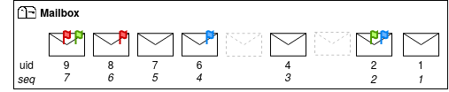
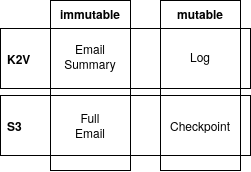
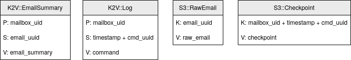

# Mailboxes

IMAP servers, at their root, handle mailboxes.
In this document, we explain the domain logic of IMAP and how we map it to Garage data
with Aerogramme.

## IMAP Domain Logic

The main specification of IMAP is defined in [RFC3501](https://datatracker.ietf.org/doc/html/rfc3501).
It defines 3 main objects: Mailboxes, Emails, and Flags. The following figure depicts  how they work together:

Emails are stored ordered inside the mailbox, and for legacy reasons, the mailbox assigns 2 identifiers to each email we name `uid` and `seq`.

`seq` is the legacy identifier, it numbers messages in a sequence. Each time an email is deleted, the message numbering will change to keep a continuous sequence without holes. 
While this numbering is convenient for interactive operations, it is not efficient to synchronize mail locally and quickly detect missing new emails.

To solve this problem, `uid` identifiers were introduced later. They are monotonically increasing integers that must remain stable across time and sessions: when an email is deleted, its identifier is never reused.
This is what Thunderbird uses for example when it synchronizes its mailboxes. 

If this ordering cannot be kept, for example because two independent IMAP daemons were adding an email to the same mailbox at the same time, it is possible to change the ordering as long as we change a value named `uid-validity` to trigger a full resynchronization of all clients. As this operation is expensive, we want to minimize the probability of having to trigger a full resynchronization, but in practice, having this recovery mechanism simplifies the operation of an IMAP server by providing a rather simple solution to rare collision situations.

Flags are tags put on an email, some are defined at the protocol level, like `\Recent`, `\Deleted` or `\Seen`, which can be assigned or removed directly by the IMAP daemon.
Others can be defined arbitrarily by the client, for which the MUA will apply its own logic.
There is no mechanism in RFC3501 to synchronize flags between MUA besides listing the flags of all the emails. 

IMAP has many extensions, such as [RFC5465](https://www.rfc-editor.org/rfc/rfc5465.html) or [RFC7162](https://datatracker.ietf.org/doc/html/rfc7162).
They are referred to as capabilities and are [referenced by the IANA](https://www.iana.org/assignments/imap-capabilities/imap-capabilities.xhtml).
For this project, we are aiming to implement only IMAP4rev1 and no extension at all.

## Aerogramme Implementation

From a high-level perspective, we will handle _immutable_ emails differently from _mutable_ mailboxes and flags.
Immutable data can be stored directly on Garage, as we do not fear reading an outdated value. 
For mutable data, we cannot store them directly in Garage.
Instead, we choose to store a log of operations. Each client then applies this log of operation locally to rebuild its local state.

During this design phase, we noted that the S3 API semantic was too limited for us, so we introduced a second API, K2V, to have more flexibility.
K2V is designed to store and fetch small values in batches, it uses 2 different keys: one to spread the data on the cluster (`P`), and one to sort linked data on the same node (`S`).
Having data on the same node allows for more efficient queries among this data. 

For performance reasons, we plan to introduce 2 optimizations. 
First, we store an email summary in K2V that allows fetching multiple entries at once.
Second, we also store checkpoints of the logs in S3 to avoid keeping and replaying all the logs each time a client starts a session.
We have the following data handled by Garage:

In Garage, it is important to carefully choose the key(s) that are used to store data to have fast queries, we propose the following model:

