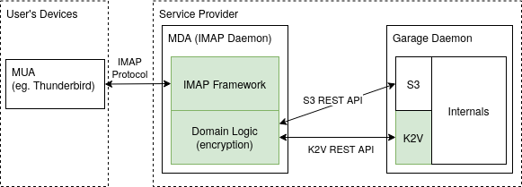
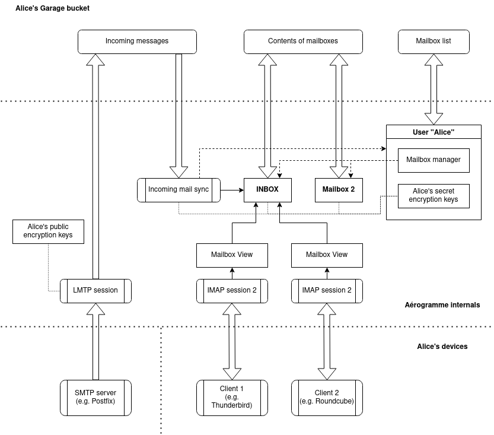
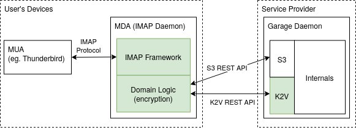

# Overview

Aérogramme stands at the interface between the Garage storage server, and the user's e-mail client. It provides regular IMAP access on the client-side, and stores encrypted e-mail data on the server-side. Aérogramme also provides an LMTP server interface through which incoming mail can be forwarded by the MTA (e.g. Postfix).

 
<i>Figure 1: Aérogramme, our IMAP daemon, stores its data encrypted in Garage and provides regular IMAP access to mail clients</i>

**Overview of architecture**

Figure 2 below shows an overview of Aérogramme's architecture. Each user has a personal Garage bucket in which to store their mailbox contents. We will document below the details of the components that make up Aérogramme, but let us first provide a high-level overview. The two main classes, `User` and `Mailbox`, define how data is stored in this bucket, and provide a high-level interface with primitives such as reading the message index, loading a mail's content, copying, moving, and deleting messages, etc. This mail storage system is supported by two important primitives: a cryptography management system that provides encryption keys for user's data, and a simple log-like database system inspired by Bayou [1] which we have called Bay, that we use to store the index of messages in each mailbox. The mail storage system is made accessible to the outside world by two subsystems: an LMTP server that allows for incoming mail to be received and stored in a user's bucket, in a staging area, and the IMAP server itself which allows full-fledged manipulation of mailbox data by users.

<i>Figure 2: Overview of Aérogramme's architecture and internal data structures for a given user, Alice</i>

**Cryptography**

Our cryptography module is taking care of: authenticating users against a data source (using their IMAP login and password), returning a set of credentials that allow read/write access to a Garage bucket, as well as a set of secret encryption keys used to encrypt and decrypt data stored in the bucket.
The cryptography module makes use of the user's authentication password as a passphrase to decrypt the user's secret keys, which are stored in the user's bucket in a dedicated K2V section.

This module can use either of two data sources for user authentication:

- LDAP, in which case the password (which is also the passphrase for decrypting the user's secret keys) must match the LDAP password of the user.
- Static, in which case the users are statically declared in Aérogramme's configuration file, and can have any password.

The static authentication source can be used in a deployment scenario shown in Figure 3, where Aérogramme is not running on the side of the service provider, but on the user's device itself. In this case, the user can use any password to encrypt their data in the bucket; the only credentials they need for authentication against the service provider are the S3 and K2V API access keys.

 
<i>Figure 3: alternative deployment of Aérogramme on the user's device: the service provider never gets access to the plaintext data.</i>

The cryptography module also has a "public authentication" method, which allows the LMTP module to retrieve only a public key for the user to write incoming messages to the user's bucket but without having access to all of the existing encrypted data.

The cryptography module of Aérogramme is based on standard cryptographic primitives from `libsodium` and follows best practices in the domain.

**Bay, a simplification of Bayou**

In our last milestone report, we described how we intended to implement the message index for IMAP mailboxes, based on an eventually-consistent log-like data structure. The principles of this system have been established in Bayou in 1995 [1], allowing users to use a weakly-coordinated datastore to exchange data and solve write conflicts. Bayou is based on a sequential specification, which defines the action that operations in the log have on the shared object's state. To handle concurrent modification, Bayou allows for log entries to be appended in non-sequential order: in case a process reads a log entry that was written earlier by another process, it can rewind its execution of the sequential specification to the point where the newly acquired operation should have been executed, and then execute the log again starting from this point. The challenge then consists in defining a sequential specification that provides the desired semantics for the application. In our last milestone report (milestone 3.A), we described a sequential specification that solves the UID assignment problem in IMAP and proved it correct. We refer the reader to that document for more details.

For milestone 3B, we have implemented our customized version of Bayou, which we call Bay. Bay implements the log-like semantics and the rewind ability of Bayou, however, it makes use of a much simpler data system: Bay is not operating on a relational database that is stored on disk, but simply on a data structure in RAM, for which a full checkpoint is written regularly. We decided against using a complex database as we observed that the expected size of the data structures we would be handling (the message indexes for each mailbox) wouldn't be so big most of the time, and having a full copy in RAM was perfectly acceptable. This allows for a drastic simplification in comparison to the proposal of the original Bayou paper [1]. On the other side, we added encryption in Bay so that both log entries and checkpoints are stored encrypted in Garage using the user's secret key, meaning that a malicious Garage administrator cannot read the content of a user's mailbox index.

**LMTP server and incoming mail handler**

To handle incoming mail, we had to add a simple LMTP server to Aérogramme. This server uses the public authentication method of the cryptography module to retrieve a set of public credentials (in particular, a public key for asymmetric encryption) for storing incoming messages. The incoming messages are stored in their raw RFC822 form (encrypted) in a specific folder of the Garage bucket called `incoming/`. When a user logs in with their username and password, at which time Aérogramme can decrypt the user's secret keys, a special process is launched that watches the incoming folder and moves these messages to the `INBOX` folder. This task can only be done by a process that knows the user's secret keys, as it has to modify the mailbox index of the `INBOX` folder, which is encrypted using the user's secret keys. In later versions of Aérogramme, this process would be the perfect place to implement mail filtering logic using user-specified rules. These rules could be stored in a dedicated section of the bucket, again encrypted with the user's secret keys.

To implement the LMTP server, we chose to make use of the `smtp-server` crate from the [Kannader](https://github.com/Ekleog/kannader) project (an MTA written in Rust). The `smtp-server` crate had all of the necessary functionality for building SMTP servers, however, it did not handle LMTP. As LMTP is extremely close to SMTP, we were able to extend the `smtp-server` module to allow it to be used for the implementation of both SMTP and LMTP servers. Our work has been proposed as a [pull request](https://github.com/Ekleog/kannader/pull/178) to be merged back upstream in Kannader, which should be integrated soon.

**IMAP server**

The last part that remains to build Aérogramme is to implement the logic behind the IMAP protocol and to link it with the mail storage primitives. We started by implementing a state machine that handled the transitions between the different states in the IMAP protocol: ANONYMOUS (before login), AUTHENTICATED (after login), and SELECTED (once a mailbox has been selected for reading/writing). In the SELECTED state, the IMAP session is linked to a given mailbox of the user. In addition, the IMAP server has to keep track of which updates to the mailbox it has sent (or not) to the client so that it can produce IMAP messages consistent with what the client believes to be in the mailbox. In particular, many IMAP commands make use of mail sequence numbers to identify messages, which are indices in the sorted array of all of the messages in the mailbox. However, if messages are added or removed concurrently, these sequence numbers change: hence we must keep a snapshot of the mailbox's index *as the client knows it*, which is not necessarily the same as what is _actually_ in the mailbox, to generate messages that the client will understand correctly. This snapshot is called a *mailbox view* and is synced regularly with the actual mailbox, at which time the corresponding IMAP updates are sent. This can be done only at specific moments when permitted by the IMAP protocol.

The second part of this task consisted in implementing all of the IMAP protocol commands. Most are relatively straightforward, however, one command, in particular, needed special care: the FETCH command. The FETCH command in the IMAP protocol can return the contents of a message to the client. However, it must also understand precisely the semantics of the content of an e-mail message, as the client can specify very precisely how the message should be returned. For instance, in the case of a multipart message with attachments, the client can emit a FECTH command requesting only a certain attachment of the message to be returned, and not the whole message. To implement such semantics, we have based ourselves on the [`mail-parser`](https://docs.rs/mail-parser/latest/mail_parser/) crate, which can fully parse an RFC822-formatted e-mail message, and also supports some extensions such as MIME. To validate that we were correctly converting the parsed message structure to IMAP messages, we designed a test suite composed of several weirdly shaped e-mail messages, whose IMAP structure definition we extracted by taking Dovecot as a reference. We were then able to compare the output of Aérogramme on these messages with the reference consisting in what was returned by Dovecot.

## References

- [1] Terry, D. B., Theimer, M. M., Petersen, K., Demers, A. J., Spreitzer, M. J., & Hauser, C. H. (1995). Managing update conflicts in Bayou, a weakly connected replicated storage system. *ACM SIGOPS Operating Systems Review*, 29(5), 172-182. ([PDF](https://dl.acm.org/doi/pdf/10.1145/224057.224070))
