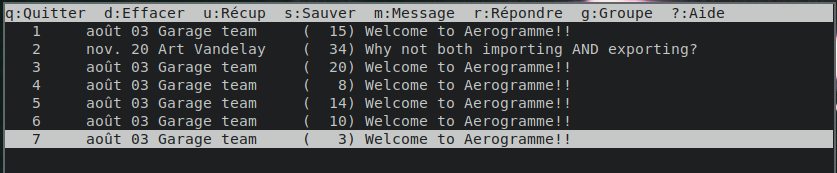
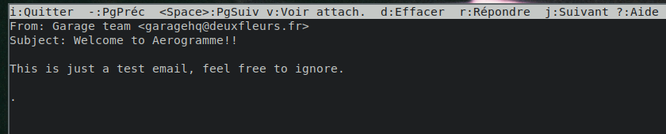

# Validate

Start a server as follow:

```bash
cargo run -- server
```

Inject emails:

```bash
./test/inject_emails.sh '<me@aerogramme.tld>' dxflrs
```

Now you can connect your mailbox with `mutt`.
Start by creating a config file, for example we used the following `~/.muttrc` file:

```ini
set imap_user = quentin
set imap_pass = p455w0rd
set folder = imap://localhost:1993
set spoolfile = +INBOX
set ssl_starttls = no
set ssl_force_tls = no
mailboxes = +INBOX
bind index G imap-fetch-mail
```

And then simply launch `mutt`.
The first time nothing will happen as Aerogramme must
process your incoming emails. Just ask `mutt` to refresh its
view by pressing `G` (for *Get*).

Now, you should see some emails:



And you can read them:


